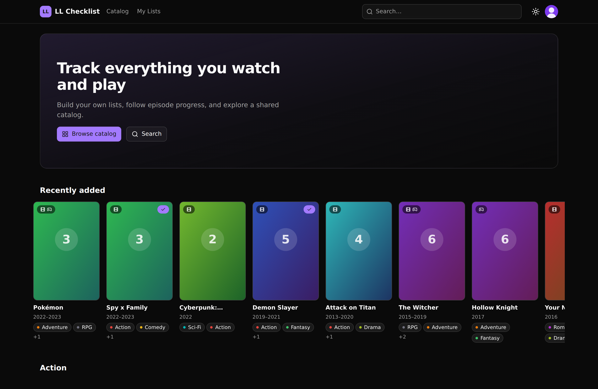
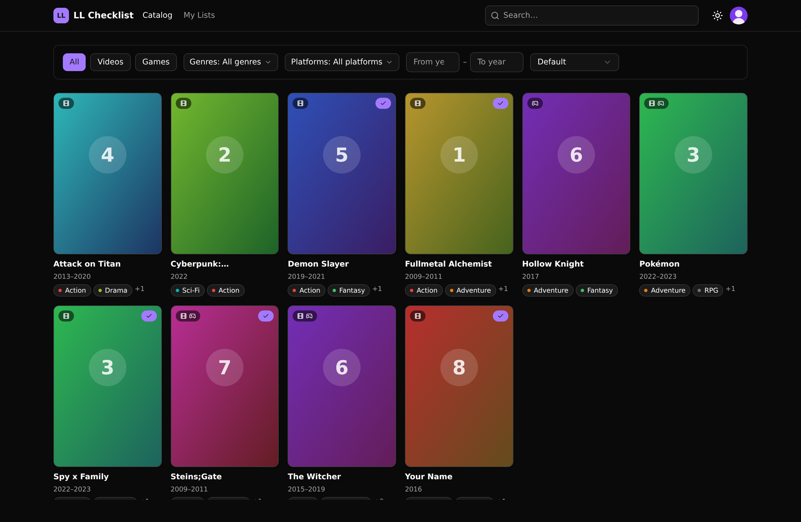
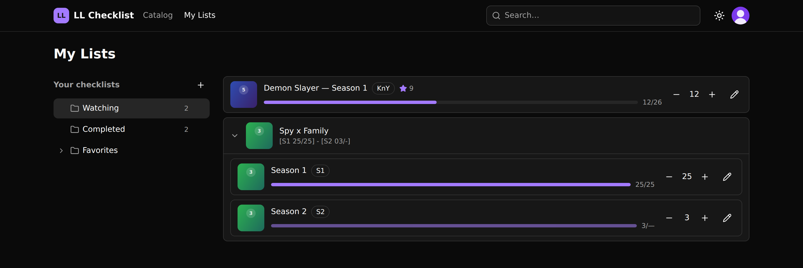
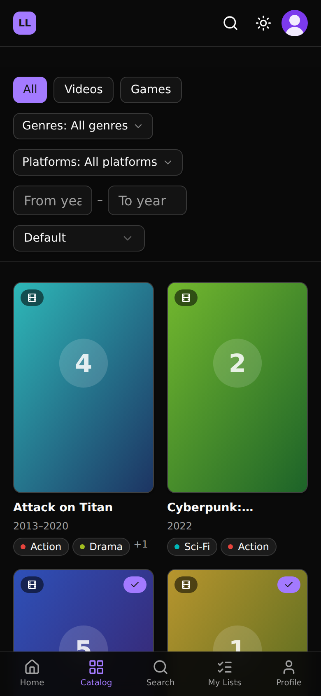

# LL Checklist — Frontend

[](https://github.com/basilycastampuero/LL-Checklist-frontend/actions/workflows/ci.yml)

A React front end for tracking anime and games: browse a shared catalog, build
nested checklists, and follow episode-by-episode progress.

**[→ Live demo](https://ll-checklist-frontend.vercel.app)** — runs entirely on
mocked data, no backend required. Sign in with **`alex@example.com`** /
**`password123`** to see the checklists and progress tracking.



---

## What it does

- **Shared catalog** of franchises, contents and versions, with filters by type,
  genre, platform and year, all driven from the URL so any view is shareable.
- **Nested checklists** as an accessible tree: create, rename, move and delete
  folders, with full keyboard navigation.
- **Episode progress** with optimistic updates — the stepper responds
  immediately and rolls back if the server rejects the change.
- **Linked copies**: adding the same version to several lists keeps their
  progress in sync.
- **Public profiles** for lists marked as published.
- Light and dark themes, a mobile layout with bottom tabs, and offline detection.

The catalog, filtered entirely from the URL:



A list with its entries — note the per-season grouping and the episode steppers:





On phones the navigation moves to a bottom tab bar; it is the layout the app was
designed around, not an afterthought.

## Stack

React 19 · TypeScript (strict, plus `noUncheckedIndexedAccess` and
`verbatimModuleSyntax`) · Vite · React Router 7 · TanStack Query 5 · Zustand ·
Zod · Axios · Tailwind CSS 4 · shadcn/ui · Motion · MSW · Vitest + Testing
Library.

## Architecture

The structure is feature-based (`src/features/<feature>/{components,hooks,services,types}`),
with one rule that everything else hangs off: **components → hooks → services**.
No component talks to the network, and no `fetch` lives in a `useEffect`.

Three decisions are worth calling out, because they shaped the rest:

**Zod validates every response, and that is the drift detector.** The backend is
a separate Odoo project owned by someone else, so the API contract can move
without warning. Each service parses its response against a schema before
returning it, which means a shape change fails loudly at the boundary instead of
surfacing three layers up as an unexplained `undefined`. One audit finding came
from the opposite mistake — a schema that was *stricter* than the contract and
turned a cosmetic backend value into a full page crash. The rule that came out of
it: Zod validates the shape of a response, not presentation conventions.

**The whole app runs on mocks.** MSW serves 100% of the API during development
and in the deployed demo, which is what makes a backend-free portfolio build
possible. It also has a cost worth naming: a mock only ever produces the happy
path, so it will not tell you that the real backend can emit a null date or an
error response without the agreed envelope. Several findings lived exactly in
that gap.

**Decisions are written down as ADRs.** Twenty-six of them so far, in
[`docs/03-decisiones-arquitectura.md`](./docs/03-decisiones-arquitectura.md),
each with the alternatives that were rejected and why.

More detail in [`src/README.md`](./src/README.md).

## Quality

- **354 tests in 63 files** (Vitest + Testing Library + MSW), plus `typecheck`
  and `lint`, all run in CI on every pull request.
- **Accessibility sweep** over 6 routes × 4 viewport widths × 2 themes, checking
  horizontal overflow, WCAG contrast, accessible names, heading order and focus
  rings. The tree, the wizard and the steppers are keyboard operable, and
  `prefers-reduced-motion` is honoured.
- **Lighthouse on the live demo**: 92 performance, 100 accessibility.
- A full code audit in October 2026 produced **26 findings, all closed**, each
  one documented with its reproduction scenario and the file and line it lived
  in — see [`docs/18-auditoria-frontend-2026-10.md`](./docs/18-auditoria-frontend-2026-10.md).

What is *not* covered, stated plainly: no screen-reader testing with NVDA or
VoiceOver has been done, and a handful of paths are verified by review rather
than by the test suite. Both are tracked in the docs.

## Documentation

Everything lives in this repository.

| | |
|---|---|
| [`docs/`](./docs/README.md) | Scope, API contract, domain model, UI design, work plan, ADRs, and a log per sprint. |
| [`docs-backend/`](./docs-backend/README.md) | Analysis of the Odoo backend, open questions for its author, and the endpoint-by-endpoint status of the REST API built for it. |
| [`docs/18-auditoria-frontend-2026-10.md`](./docs/18-auditoria-frontend-2026-10.md) | The audit: 26 findings with scenario, location and the false green that hid each one. |

The documentation is written in Spanish; this README is the English entry point.

## Getting started

Requires Node.js 22, pinned in `.nvmrc` and in `package.json`'s `engines`.

```bash
npm install
npm run dev        # http://localhost:5173, backed by MSW
```

No backend, no environment file, no database. The mock serves the catalog, the
session and the lists.

| Script | What it does |
|---|---|
| `npm run dev` | Dev server with MSW. |
| `npm run build` | Type-check, then production build. |
| `npm run preview` | Serve the build. |
| `npm run test` | Vitest, single pass — exactly what CI runs. |
| `npm run typecheck` | `tsc --noEmit`. |
| `npm run lint` | ESLint (flat config). |
| `npm run format` | Prettier over `src/`. |
| `npm run seed:odoo` | Load the mock catalog into a local Odoo (see below). |

### Data mode

| Variable | Default | Meaning |
|---|---|---|
| `VITE_API_MODE` | `mock` in dev, `real` in a production build | `mock` uses MSW; `real` proxies to the backend. |
| `VITE_API_BASE_URL` | `/api/v1` | Contract prefix. |
| `VITE_ODOO_URL` | `http://localhost:8069` | Proxy target in `real` mode. |

The production default is `real` on purpose: a deployment that forgets the
variable should not quietly serve a fake API. The demo sets `mock` explicitly in
`vercel.json`.

To exercise the UI's error states without touching code, append
`?mockError=INTERNAL` to the URL — any code from the contract works.

<details>
<summary><b>Running with Docker</b> — no Node needed on the host</summary>

Commands run from the **workspace root**, where `docker-compose.yml` lives, not
from this folder.

```bash
docker compose up frontend                      # dev server on :5173, against MSW
docker compose --profile test up frontend-test  # tests in watch mode
docker compose run --rm frontend npm run lint   # one-off command
```

The source is bind-mounted, so changes apply instantly; `node_modules` lives in a
named volume so it never mixes with the host's.

**Production image (nginx):**

```bash
docker build --target production -t ll-checklist-frontend .
docker run -p 8080:80 ll-checklist-frontend
```

Serves the static bundle with route fallback for React Router
(`docker/nginx.conf`).

**On WSL:** if Docker Desktop runs on Windows with WSL integration disabled, the
`docker` command does not exist inside WSL. Either enable the integration or call
the Windows CLI directly at
`/mnt/c/Program Files/Docker/Docker/resources/bin/docker.exe`.

</details>

<details>
<summary><b>Running against the real Odoo backend</b></summary>

```bash
docker compose --profile backend up
VITE_API_MODE=real VITE_ODOO_URL=http://odoo:8069 docker compose up frontend
```

`odoo` is the service name on Compose's internal network — not `localhost`,
because the proxy runs inside the frontend container. Odoo ends up on
[localhost:8069](http://localhost:8069), database `anitrack`, login
`admin` / `admin`.

**Why there is a custom entrypoint:** the backend's own `entrypoint.sh` uses
`--init=all`, which in Odoo does *not* install every available module — only
`base` and those with `auto_install=True`. The project's own modules
(`ll_checklist`, `ll_oauth`, `ll_webpage`) are `auto_install=False`, so they were
never installed. `docker-init/odoo-dev-entrypoint.sh` installs those three
explicitly. It is idempotent, so restarting once the database exists takes a
couple of seconds.

**Bind mount vs copy:** unlike the frontend, the `odoo` service *copies*
`odoo-modules/` into the image. Editing backend code is not reflected without
rebuilding (`docker compose build odoo`).

</details>

<details>
<summary><b>Seeding the catalog into a local Odoo</b></summary>

`npm run seed:odoo` (`scripts/seed-odoo.mjs`, plain Node, no dependencies) loads
the same dataset MSW serves: 10 franchises, 14 contents, 19 versions, 11 genres,
5 platforms, 6 companies, 3 countries, 11 images. It needs the backend running.

It is idempotent — it looks before creating. `--reset` deletes the seeded
franchises first and recreates them.

```bash
npm run seed:odoo
npm run seed:odoo -- --reset
```

Configurable through `ODOO_URL`, `ODOO_DB`, `ODOO_USER` and `ODOO_PASSWORD`, all
defaulting to the local Compose setup. Without seeded data the catalog endpoints
answer empty and prove nothing — see
[`docs/11-spike-integracion-real.md`](./docs/11-spike-integracion-real.md).

</details>

## About the backend

The backend is an Odoo project owned by another developer and lives in its own
repository. This front end consumes a REST API under `/api/v1` that was built for
it as part of this work; its endpoint-by-endpoint status is documented in
[`docs-backend/14-resumen-implementacion-api.md`](./docs-backend/14-resumen-implementacion-api.md).

The deployed demo does not touch that backend at all — it runs on MSW, which is
why the link above works without any server behind it.
